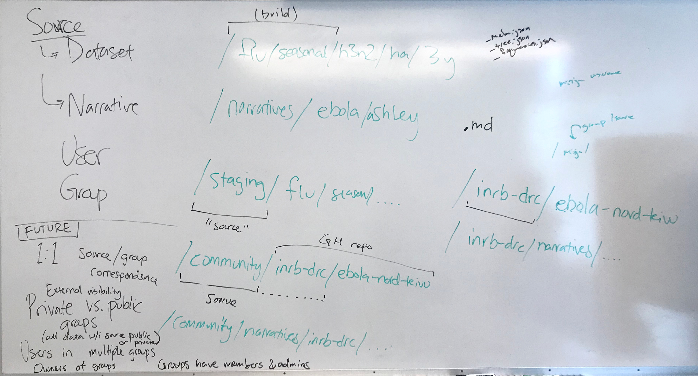
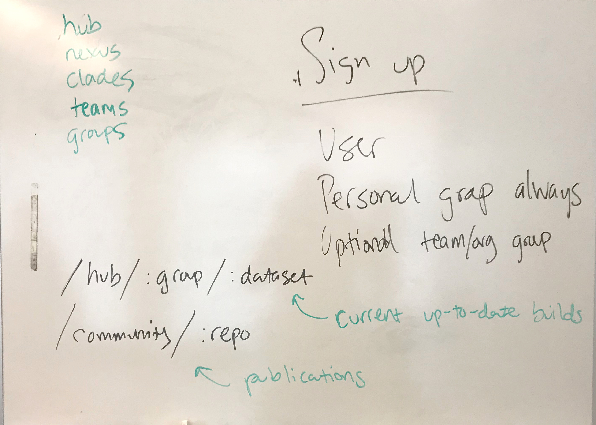

# Nextstrain users/groups and sources/datasets

Ahead of Alli and James' trip to the DRC, I did a groundwork implementation of
users and private datasets and narratives on nextstrain.org for
[INRB](https://inrb.net) to use.  This implementation is based on the
requirements for INRB as well as my vision for Nextstrain's future.

Following that work, a set of Seattle folks (Trevor, John, Jover, Kairsten, and
Misja) met on 6 September 2019 to discuss and improve upon that vision and map
out a proposal.  These are notes from that meeting.

## Names

The set of major features described here are essentially a new Nextstrain
"product", which I think would be useful to consistently brand and promote.  We
bandied about several possible names:

* Nextstrain Hub (e.g. nextstrain.org/hub/inrb-drc)
* Nextstrain Nexus (nextstrain.org/nexus/inrb-drc)
* Nextstrain Clades (nextstrain.org/clade/inrb-drc)
* Nextstrain Teams (nextstrain.org/team/inrb-drc)
* Nextstrain Groups (nextstrain.org/group/inrb-drc)
* Nextstrain Organizations (nextstrain.org/organization/inrb-drc)

I'm a bit partial to Nextstrain Nexus because of the fun alliteration and play
on words with the [NEXUS file format](https://en.wikipedia.org/wiki/Nexus_file).

That said, Hubs are currently popular in computing (GitHub, Docker Hub, etc),
and I think Organization parallels well with our existing Community space.

## Concepts

With my groundwork for INRB, I introduced several concepts into the
[nextstrain.org codebase](https://github.com/nextstrain/nextstrain.org),
independent of Auspice.  These form the basis for the current and envisioned
functionality.

* **User** — An individual account with a set of credentials.  Users are
  members of one or more groups.  Intended to be used by a single person but
  credentials may be shared in some cases (as INRB is currently doing, I
  believe).

* **Group** — A set of users (the members).  In the future, one or more members
  are owners of the group and may modify membership or visibility.  Groups may
  be public or private to the members.  Every group has one source.

* **Source** — A container for datasets and narratives.  Sources may be public
  to all or private to a group.  Every group has a source.  Some special
  sources exist, like "live" (official/endorsed/blessed/etc), "staging", and
  "community".  The origin of files may be S3 buckets (e.g. nextstrain-data,
  nextstrain-inrb), GitHub repos (e.g. blab/zika-colombia), or other data
  stores.  This detail is abstracted into the source concept.

* **Dataset** — A single tree + metadata, e.g. flu/seasonal/h3n2/ha/2y.  This
  corresponds directly to a set of Auspice JSON files with a shared prefix
  (e.g. `flu_seasonal_h3n2_ha_2y_tree.json`, `…_meta.json`, `…_frequencies.json`).

* **Narrative** — A single Markdown file containing Auspice's special narrative
  syntax.

* **Build** — A set of code and data (often in a git repo) used to produce
  datasets (often with augur), e.g.
  [nextstrain/seasonal-flu](https://github.com/nextstrain/seasonal-flu).  Not a
  concept within nextstrain.org itself, but useful to define given the above.

### URLs

I think it's illustrative to see how these concept map to URLs (or vice versa).

Current examples of accessing datasets:

     /flu/seasonal/h3n2/ha/2y
    └─────── dataset ────────┘  (implicit "live" source)

     /staging/flu/seasonal/h3n2/ha/2y
    └ source ┴────── dataset ────────┘

     /community/blab/zika-colombia
    └─ source ─┴──── dataset ─────┘

     /inrb-drc/ebola/2019-09-14
    └ source ─┴─── dataset ────┘

and accessing narratives:

     /narratives/twenty-years-of-WNV
                └─── narrative ─────┘  (implicit "live" source)

     /staging/narratives/twenty-years-of-WNV
    └ source ┘          └─── narrative ─────┘

     /community/narratives/nextstrain/community-narratives-test/intro-to-narratives
    └─ source ─┘          └───────────────────── narrative ────────────────────────┘

     /inrb-drc/narratives/ebola/2019-09-14-sit-rep-ENGLISH
    └ source ─┘          └────────── narrative ───────────┘

In order to limit the number of top-level reserved words, the `/inrb-drc/…`
examples would change to (using Hub as the name for now):

     /hub/inrb-drc/ebola/2019-09-14
         └ group ─┴─── dataset ────┘

     /hub/inrb-drc/narratives/ebola/2019-09-14-sit-rep-ENGLISH
         └ group ─┘          └────────── narrative ───────────┘

## Sign up

Currently, Nextstrain's limited users & groups are manually created and managed
by us (the admins).  There is no sign up form, although users can self-manage
their passwords once they're created.

**This state of things is very manageable for the first several potential
partners, like INRB, WA DOH, CDC-GISRS, etc.**  User creation is expected to be
part of an upfront, high-touch onboarding process with occasionally management
later.

The eventual sign up process is expected to create two or three things:

1. A new user
2. A new personal group for that user (with same name)
3. Optionally, a new shared team/org group with some desired name

Every user has a personal group which has a 1:1 association with a source.  The
user can add other users to their personal group if they so desire, or they can
remain the sole member.

A new shared group is optionally created if the user indicates, in response to
a sign up question, that they're planning to collaborate with
colleagues/coworkers.

## Whiteboard

Photos of the whiteboard after our discussion, for posterity.

