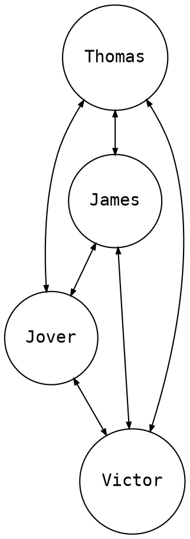
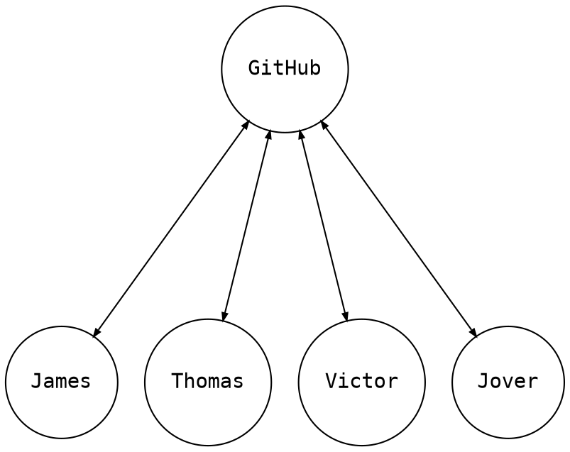

# 24 October 2022
# or, lab meeting prep for tomorrow

"How we work: software as a team sport"

- Who is this for?
  - discuss: programmer vs. software developer vs. software engineer (are these actual distinctions? not really)

  - caveat programmator: software development is a broad spectrum and
    contextually dependent; what I'm discussing here is mostly _descriptive_
    not _prescriptive_. the goal is to shine a bit of light on something that I
    suspect is murky to many in the lab. these are universal rules, they're not
    even _our_ rules all the time; these are just _one team's practices_.

  - don't use process for process' sake; use it if it gains you more than it
    costs.  note that gains may be incremental over time or only realized in
    the future, while costs are usually bourne immediately and continuously.

- Repositories
  - very briefly to set the stage; most folks know this
  - remote (GitHub) vs. local (`git clone`)
  - diagram of centralized workflow; there are other non-centralized workflows
    but practices often differ in that contexts
  - I'll be showing git on command line (will I?), but this is not the only way

- Feature branches vs. main/master branch
  - short lived vs. long lived
  - often single author vs. often multi-author
  - how you make PRs vs. what PRs merge into
  - drafting, iteration, rewriting, etc. vs. your software's story, it's biography
  - Bringing in updates from main/master

- Code review
  - what it is
    - a form of peer review!
  - why we do it
  - <https://wiki.nextstrain.org/t/code+review> or
    <https://nextstrain.atlassian.net/wiki/spaces/NEXTSTRAIN/pages/138215425/Code+review>
  - socializing of changes more than fixing bugs
  - merging post-review vs. pre-review (vs. committing to main/master as (probably) no-review)

- Continuous integration (CI)
  - Build
  - Test
    - unit tests ("does this function work?")
    - integration tests ("does the thing work as a whole?")
    - smoke tests ("does it install? does it run? e.g. `nextstrain --help` at least work?")
    - linting (shellcheck, eslint, flake8, black, etc.)
    - any other useful checks for your code
  - Release

- Merging
  - The way you integrate changes
  - merge commits (usually but not always!) have two parents: main and topic-branch
  - git is a dag
  - Merging vs. fast-forwarding
  - Squashing, rebasing, etc.

